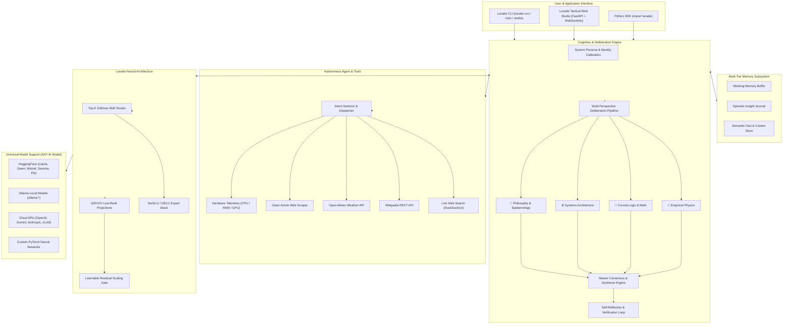

<div align="center">

# 🌙 Lunaite Architecture
### Universal Modular Intelligence & Sparse MoE Framework

[](https://opensource.org/licenses/MIT)
[](https://www.python.org/downloads/)
[](https://pytorch.org/)
[](https://huggingface.co/)
[](https://ollama.com/)
[](https://github.com/hallow-mk3/Lunaite)
[](https://github.com/hallow-mk3/Lunaite/pulls)

**Engineered by Swasthik Shetty** • [swasthik.mk3@gmail.com](mailto:swasthik.mk3@gmail.com) • [GitHub: @hallow-mk3](https://github.com/hallow-mk3)

<p align="center">
  <b>Attach Sparse Mixture-of-Experts (MoE) Residual Routing, Multi-Perspective Cognitive Deliberation, Multi-Tier Episodic Memory, and Autonomous Tool Suites to ANY AI Model.</b>
</p>

---

</div>

## 🌟 Overview

**Lunaite Architecture** is a universal, open-source AI architecture framework. It provides a modular cognitive and neural layer that can be attached to **any foundation model**—including **Hugging Face Transformers** (Llama 3, Qwen 2.5, Mistral, Gemma, Phi, DeepSeek), **local Ollama models**, **PyTorch neural networks**, or **cloud APIs** (OpenAI, Anthropic, Gemini, Groq, vLLM).

Lunaite transforms standard causal language models into self-reflective, multi-disciplinary cognitive agents equipped with:

1. **⚡ Sparse Mixture-of-Experts (MoE) Residual Adapters**: Dynamic Top-$K$ routing with load-balancing loss, SwiGLU/GELU expert networks, and residual scaling.
2. **🧠 Multi-Perspective Cognitive Deliberation**: Structured parallel deliberation across empirical physical sciences, formal mathematical logic, systems architecture, and philosophy.
3. **💾 Multi-Tier Persistent Memory Bank**: Working memory buffer, timestamped episodic insight logs, and persistent semantic user fact stores.
4. **🌐 Autonomous Live Agent & Tool Suite**: Integrated DuckDuckGo search, Wikipedia lookup, Open-Meteo real-time global weather, clean web scraping, and deep system telemetry.
5. **🎛️ Glassmorphism Tactical Web Studio & CLI**: Real-time WebSocket hardware telemetry, live loss curves, dataset inspection, and interactive streaming chat.

---

## 🏛️ System Architecture



---

## 📐 Mathematical Formulation

### 1. Dynamic Top-$K$ Sparse Routing with Stochastic Gating

Given token embedding $x \in \mathbb{R}^{d_{\text{model}}}$ across $N$ experts:

$$H(x)_i = (x W_g)_i + \epsilon \cdot \text{softplus}\left((x W_{\text{noise}})_i\right), \quad \epsilon \sim \mathcal{N}(0, 1)$$

The gating router selects the top $k$ expert indices $\mathcal{T} = \text{TopK}(H(x), k)$ and computes normalized softmax routing weights:

$$G(x)_i = \begin{cases} \frac{\exp(H(x)_i)}{\sum_{j \in \mathcal{T}} \exp(H(x)_j)} & \text{if } i \in \mathcal{T} \\ 0 & \text{otherwise} \end{cases}$$

The MoE layer output with residual injection is computed as:

$$y = x + \alpha_{\text{gate}} \sum_{i \in \mathcal{T}} G(x)_i \cdot E_i(x)$$

### 2. Auxiliary Load-Balancing Loss

To ensure uniform expert utilization and prevent routing collapse during training, Lunaite optimizes the auxiliary loss $\mathcal{L}_{\text{aux}}$:

$$\mathcal{L}_{\text{aux}} = N \sum_{i=1}^N P_i \cdot f_i$$

Where:
- $P_i = \frac{1}{T} \sum_{t=1}^T \text{softmax}(x_t W_g)_i$ (mean probability assigned to expert $i$)
- $f_i = \frac{1}{T} \sum_{t=1}^T \mathbb{I}(i \in \mathcal{T}_t)$ (fraction of tokens dispatched to expert $i$)

### 3. LoRA Architectural Projection

For target attention projection $W_0 \in \mathbb{R}^{d \times k}$:

$$h = W_0 x + \frac{\alpha}{r} (B A) x, \quad A \in \mathbb{R}^{r \times k}, \; B \in \mathbb{R}^{d \times r}, \; r \ll \min(d, k)$$

---

## 🚀 Quick Start

### Installation

```bash
# Clone the repository
git clone https://github.com/hallow-mk3/Lunaite.git
cd Lunaite

# Install Lunaite package
pip install -e .

# Or install dependencies directly
pip install -r requirements.txt
```

---

### Use Case 1: Wrap ANY Local Ollama Model

Empower any local Ollama model (`qwen2.5`, `llama3.1`, `mistral`, `gemma2`, `phi3`) with Lunaite cognitive deliberation and autonomous tools:

```python
import lunaite

# 1. Connect to any Ollama model
model = lunaite.from_ollama("qwen2.5:7b")

# 2. Autonomous live information search & synthesis
response = model.generate(
    "What is the weather in Tokyo and what are the latest space mission updates?",
    use_agent=True
)
print(response)

# 3. Multi-Perspective Cognitive Deliberation (Physics, Logic, Philosophy)
deliberation = model.generate(
    "Explain the implications of quantum gravity on black hole information loss.",
    use_deliberation=True
)
print(deliberation)
```

---

### Use Case 2: Wrap ANY Hugging Face Transformer Model

Attach the Lunaite Sparse MoE Adapter and LoRA layers directly to any Hugging Face Causal LM:

```python
import lunaite

# Wrap any HuggingFace model
model = lunaite.wrap("Qwen/Qwen2.5-1.5B-Instruct", backend="huggingface")

# Chat with persistent memory and persona calibration
response = model.chat("Explain the difference between general relativity and special relativity.")
print(response)
```

---

### Use Case 3: Universal Single-Line Model Wrapping

```python
import lunaite

# Automatically detects model type and attaches Lunaite Architecture:
m1 = lunaite.wrap("llama3.1:8b")                    # Ollama
m2 = lunaite.wrap("meta-llama/Llama-3-8B-Instruct")  # HuggingFace
m3 = lunaite.wrap("gpt-4o", backend="api")           # OpenAI-compatible API
```

---

### Use Case 4: Standalone PyTorch Sparse MoE Module

Use Lunaite's neural building blocks directly in your own neural networks:

```python
import torch
import lunaite

# Instantiate Lunaite MoE Layer
moe = lunaite.LunaiteMoELayer(
    d_model=4096,
    num_experts=8,
    top_k=2,
    expert_dim=1024,
    activation="gelu"
)

# Input tokens: (batch_size, seq_len, d_model)
x = torch.randn(2, 16, 4096)
output, aux_loss = moe(x)

print("Output shape:", output.shape)   # torch.Size([2, 16, 4096])
print("Auxiliary Loss:", aux_loss.item())
```

---

## 🖥️ Interactive Web Studio & CLI

### Launch the Tactical Web Studio

```bash
# Start the FastAPI + WebSocket Web Studio (opens http://127.0.0.1:8000)
python launch_studio.py
# or
lunaite studio --port 8000
```

**Studio Features:**
- 📊 **Dynamic Architecture Calculator**: Real-time parameter scaling, sparsity ratio, and memory footprint calculation.
- 📂 **Dataset Ingestion & Validation**: Load `.jsonl`, `.csv`, `.json`, or `.md` datasets and preview samples.
- ⚡ **1-Click LoRA / MoE Fine-Tuning**: Run asynchronous training with live WebSocket loss streaming.
- 💬 **Interactive Chat**: Streaming dialogue with hardware vitals telemetry, memory inspection, and voice synthesis.

---

### Command Line Interface (CLI)

```bash
# 1. Interactive terminal chat with any model
lunaite run qwen2.5:7b
lunaite run llama3.1:8b --deliberate

# 2. Fine-tune any base model with Lunaite LoRA / MoE
lunaite train --base-model Qwen/Qwen2.5-7B --dataset data/lunaite_training_data.jsonl --epochs 3

# 3. Merge adapter weights into standalone model
lunaite merge --base-model Qwen/Qwen2.5-7B --adapter ./lunaite_weights --output ./lunaite_merged

# 4. View system telemetry & diagnostics
lunaite info
```

---

## 📊 Rigorous Parameter Scaling Metrics

Lunaite provides exact, uninflated mathematical parameter calculations:

| Base Model | Architecture Stack | Total Parameters | Active per Token | Sparsity Ratio | Added Adapters |
|---|---|---|---|---|---|
| **1.5B Foundation** | LoRA ($r=64$) + MoE ($E=8, K=2$) | **1.85B** | 1.62B | 12.4% | +350M |
| **7B Foundation** | LoRA ($r=64$) + MoE ($E=8, K=2$) | **9.27B** | 7.66B | 17.4% | +2.27B |
| **8B Foundation** | LoRA ($r=128$) + MoE ($E=8, K=2$) | **10.82B** | 8.84B | 18.3% | +2.82B |
| **14B Foundation** | LoRA ($r=128$) + MoE ($E=16, K=4$) | **18.94B** | 15.23B | 19.6% | +4.94B |

Calculate parameter dimensions programmatically:

```python
import lunaite

stats = lunaite.calculate_architecture_parameters(
    base_params=7_000_000_000,
    d_model=4096,
    num_layers=32,
    num_experts=8,
    expert_dim=1024,
    lora_rank=64
)

print(stats["total_model_parameters_formatted"])  # '9.27B'
print(stats["active_parameters_formatted"])       # '7.66B'
print(stats["sparsity_ratio"])                   # '17.4%'
```

---

## 📁 Repository Structure

```
Lunaite/
├── .gitignore                      # Clean Git exclusions
├── LICENSE                         # MIT License
├── README.md                       # Comprehensive Technical Documentation
├── pyproject.toml                  # Modern PEP 621 Build Configuration
├── setup.py                        # Package Installation Setup
├── requirements.txt                # Production Dependencies
├── Modelfile                       # Ollama Model Definition
│
├── lunaite/                        # Core Python Package
│   ├── __init__.py                 # Top-Level SDK Exports
│   ├── config.py                   # Dataclass Configurations (MoE, LoRA, Cognitive, Memory, Agent)
│   ├── cli.py                      # Rich Command-Line Interface
│   │
│   ├── core/                       # Neural & Cognitive Architecture
│   │   ├── __init__.py
│   │   ├── architecture.py         # TopK MoE Router, SwiGLU Experts, LoRA Adapters
│   │   ├── cognitive.py            # Multi-Perspective Deliberation & Verification Engine
│   │   └── memory.py               # Multi-Tier Persistent Memory Store
│   │
│   ├── models/                     # Universal Model Wrappers
│   │   ├── __init__.py
│   │   ├── base.py                 # Abstract Base Model Interface
│   │   ├── ollama.py               # Universal Ollama Adapter
│   │   ├── huggingface.py          # Universal HuggingFace Adapter
│   │   ├── api.py                  # OpenAI-Compatible API Adapter
│   │   └── wrapper.py              # lunaite.wrap() Universal Factory
│   │
│   ├── agent/                      # Autonomous Tools & Telemetry
│   │   ├── __init__.py
│   │   ├── suite.py                # Agent Intent Detector & Tool Orchestrator
│   │   ├── tools.py                # DuckDuckGo, Wikipedia, Open-Meteo, URL Scraper
│   │   └── desktop.py              # Hardware Telemetry, Clipboard, Screenshots, PowerShell
│   │
│   ├── train/                      # Training & Deployment Engine
│   │   ├── __init__.py
│   │   ├── trainer.py              # PyTorch LoRA / QLoRA Fine-Tuning Engine
│   │   ├── dataset.py              # Dataset Ingestion, Validation & Presets
│   │   └── exporter.py             # Model Weight Merger & Modelfile Generator
│   │
│   └── server/                     # Web Application Backend
│       ├── __init__.py
│       └── studio.py               # FastAPI + WebSocket Studio Server
│
├── web/                            # Tactical JARVIS / Glassmorphism Web Interface
│   ├── index.html                  # Responsive Web UI
│   ├── style.css                   # Custom CSS Design System
│   └── app.js                      # Dynamic WebSocket & Telemetry Frontend
│
├── examples/                       # End-to-End Code Examples
│   ├── 01_wrap_huggingface_model.py
│   ├── 02_wrap_ollama_model.py
│   ├── 03_standalone_moe_adapter.py
│   └── 04_multi_agent_deliberation.py
│
├── tests/                          # Automated Unit Test Suite
│   ├── test_architecture.py        # MoE & Adapter Math Verification
│   ├── test_memory.py              # Persistence & Retrieval Tests
│   └── test_tools.py               # Tool Execution & Telemetry Tests
│
├── data/                           # Training & Knowledge Data
│   └── lunaite_training_data.jsonl # Multi-Domain Synthetic Calibration Dataset
│
├── chat_lunaite.py                 # Interactive Terminal Chat Launcher
├── launch_studio.py                # Web Studio Launcher
└── train_lunaite_lora.py           # Standalone Training Script
```

---

## 🧪 Automated Testing

Run the test suite across all modules:

```bash
python -m unittest discover tests
```

---

## 🤝 Contributing

Contributions are warmly welcomed! Feel free to:
- Open an issue for feature requests, bug reports, or architectural suggestions.
- Submit a pull request with new expert modules, dataset presets, or integrations.

---

## 📜 Citation

If you use Lunaite Architecture in your research or projects, please cite:

```bibtex
@software{shetty2026lunaite,
  author = {Swasthik Shetty},
  title = {Lunaite: Universal Modular AI Architecture Framework},
  year = {2026},
  url = {https://github.com/hallow-mk3/Lunaite},
  note = {Sparse Mixture-of-Experts Residual Routing, Cognitive Deliberation, and Persistent Memory for Foundation Models}
}
```

---

## 📄 License & Author

- **Author**: **Swasthik Shetty**
- **Contact**: [swasthik.mk3@gmail.com](mailto:swasthik.mk3@gmail.com)
- **GitHub**: [https://github.com/hallow-mk3](https://github.com/hallow-mk3)
- **Repository**: [https://github.com/hallow-mk3/Lunaite](https://github.com/hallow-mk3/Lunaite)
- **License**: [MIT License](LICENSE)
